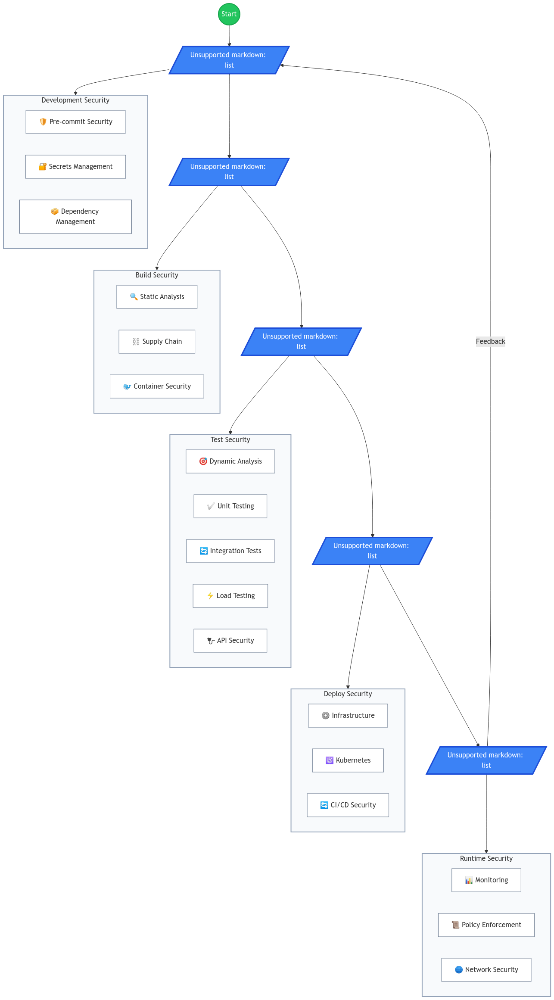

# Free and Open Source DevSecOps Tools

This repo include a comprehensive collection of free and open-source tools that cover the entire DevSecOps lifecycle. Here's the big picture:

1. **Developer Security Tools**
- Pre-commit tools that catch issues before code is committed
- Code formatting and linting tools
- Type checkers and basic security scanners

2. **Application Security**
- Secret management solutions for protecting sensitive data
- Dependency scanning to find vulnerable packages
- Static (SAST) and Dynamic (DAST) security testing tools
- Supply chain security tools to ensure code integrity

3. **Infrastructure Security**
- Container security scanners (like Trivy and Clair)
- Kubernetes security tools (kube-bench, kube-hunter)
- Infrastructure as Code security scanners (checkov, tfsec)
- Network security tools (Wireshark, nmap)

4. **Pipeline & Operations**
- CI/CD security tools integrated with popular platforms
- Testing tools for unit, integration, and load testing
- Monitoring and observability solutions
- Policy enforcement tools to ensure security compliance

The document also includes practical examples showing:
- How to set up pre-commit hooks
- How to integrate security checks in Jenkins pipelines
- How to implement Kubernetes security policies
- How to write basic security policies using Open Policy Agent (OPA)

# DevSecOps Tools Reference Table

## Development Security

### Pre-commit Tools
| Tool | Type | Purpose | Key Features |
|------|------|---------|--------------|
| pre-commit | Framework | Git hook management | - Multi-language support - Plugin ecosystem - Easy configuration |
| black | Code Formatter | Python formatting | - Deterministic output - PEP 8 compliant - IDE integration |
| ruff | Linter | Python linting | - High performance - Extensible rules - Auto-fixes |
| mypy | Type Checker | Python type checking | - Static type verification - Type inference - Plugin system |
| hadolint | Linter | Dockerfile validation | - Best practice checks - Shell script validation - Integration support |
| yamllint | Validator | YAML validation | - Syntax verification - Style checking - Customizable rules |
| detect-secrets | Scanner | Secrets detection | - Pattern matching - Custom rules - CI integration |
| gitleaks | Scanner | Secrets detection | - Git history scanning - Multiple secret types - High accuracy |

### Secrets Management
| Tool | Type | Key Features |
|------|------|--------------|
| Mozilla SOPS | Encryption Tool | - Multiple cloud KMS support - File encryption - Git integration |
| git-crypt | Git Tool | - Transparent encryption - File-specific rules - GPG support |
| Sealed Secrets | Kubernetes Tool | - One-way encryption - Controller-based - GitOps friendly |
| AWS Secrets Manager | Cloud Service | - Rotation support - Fine-grained access - API integration |
| Azure Key Vault | Cloud Service | - Certificate management - Key management - HSM support |
| Google Secret Manager | Cloud Service | - Version control - IAM integration - Audit logging |

## Security Testing

### SAST Tools
| Tool | Language Focus | Key Features |
|------|---------------|--------------|
| SonarQube CE | Multi-language | - Code quality metrics - Security hotspots - Technical debt tracking |
| Bandit | Python | - AST scanning - Plugin system - Configuration options |
| Semgrep | Multi-language | - Pattern matching - Custom rules - Quick scanning |
| PMD | Java | - Custom rules - Extensible - Multiple formats |
| ESLint | JavaScript | - Pluggable - Automatic fixing - Custom rules |
| CodeQL | Multi-language | - Query language - Deep analysis - GitHub integration |

### DAST Tools
| Tool | Type | Key Features |
|------|------|--------------|
| OWASP ZAP | Web Scanner | - Active/passive scanning - API testing - Automation support |
| Nikto | Web Scanner | - Comprehensive checks - Multiple report formats - Plugin architecture |
| w3af | Web Scanner | - Plugin-based - Multiple interfaces - Advanced scanning |
| SQLmap | SQL Injection | - Automatic exploitation - Database fingerprinting - Multiple techniques |

## Infrastructure Security

### Container Security
| Tool | Purpose | Key Features |
|------|---------|--------------|
| Trivy | Vulnerability Scanner | - Fast scanning - Low false positives - Multiple formats |
| Clair | Container Analysis | - Layer scanning - API integration - Version tracking |
| Docker Bench | Security Checker | - CIS benchmark - Best practices - Detailed reports |
| Falco | Runtime Security | - Real-time monitoring - Custom rules - Container insights |

### Infrastructure Testing
| Tool | Focus | Key Features |
|------|-------|--------------|
| checkov | IaC Scanner | - Multiple IaC types - Policy as code - CI integration |
| tfsec | Terraform | - Security scanning - Custom rules - Inline ignores |
| kube-bench | Kubernetes | - CIS benchmarks - Comprehensive checks - Remediation advice |
| kube-hunter | Kubernetes | - Penetration testing - Network scanning - Risk assessment |

## Operations Tools

### CI/CD Security
| Tool | Type | Key Features |
|------|------|--------------|
| Jenkins | CI Server | - Plugin ecosystem - Pipeline as code - Extensive integration |
| GitLab CI | CI/CD Platform | - Built-in security - Container registry - Auto DevOps |
| GitHub Actions | CI/CD Service | - Workflow automation - Matrix builds - Community actions |
| Argo CD | GitOps Tool | - Kubernetes native - Declarative setup - Auto-sync |

### Monitoring & Testing
| Tool | Category | Key Features |
|------|----------|--------------|
| Prometheus | Metrics | - Time-series DB - Alert management - Pull model |
| Grafana | Visualization | - Multiple sources - Custom dashboards - Alerting |
| JMeter | Load Testing | - Scalable testing - Multiple protocols - Extensible |
| Postman | API Testing | - Request builder - Automation - Team collaboration |

### Network Security
| Tool | Type | Key Features |
|------|------|--------------|
| Wireshark | Packet Analyzer | - Deep packet inspection - Protocol analysis - Capture filters |
| nmap | Network Scanner | - Port scanning - Service detection - Script engine |
| Snort | IDS/IPS | - Real-time traffic analysis - Rule-based detection - Protocol analysis |
