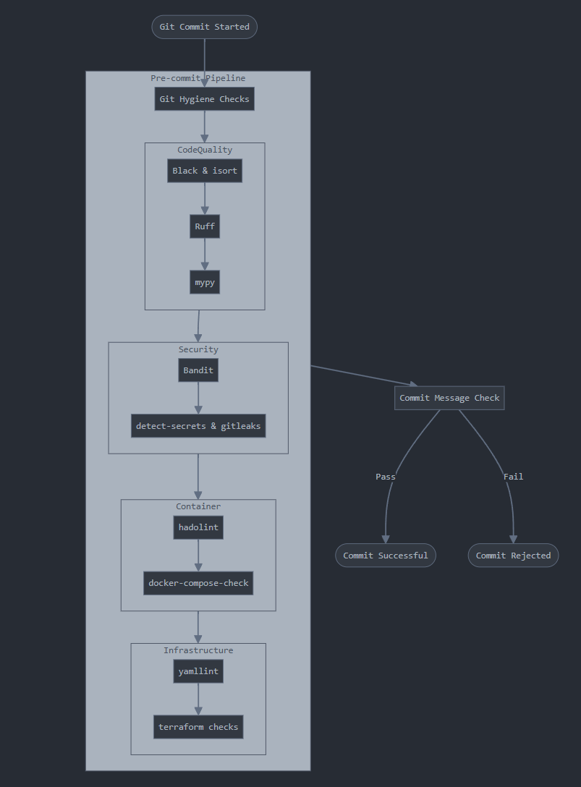

# Pre-commit Tools Suite

A robust, enterprise-grade pre-commit configuration enforcing code quality, security, and consistency standards across your development lifecycle.

## Quick Start

```bash
pip install pre-commit>=3.5.0
pre-commit install && pre-commit install --hook-type commit-msg
```

## Core Features

- Zero-configuration security scanning
- Automated code formatting and linting
- Infrastructure as Code (IaC) validation
- Docker best practices enforcement
- Conventional commit standardization

## Technical Requirements

- Python 3.11+
- Git 2.28+
- Docker Engine 20.10+ (for container validations)
- Terraform 1.0+ (for IaC validations)

## Architecture



Our pre-commit pipeline implements a multi-layered validation approach:

### Layer 1: Git Hygiene
Prevents common VCS issues through essential git checks:
- Case-sensitive path conflicts
- Unresolved merge markers
- Invalid symlinks
- Large file restrictions (>500KB)
- Debug statement detection
- Syntax validation (YAML, TOML, JSON)
- Line ending normalization (LF)

### Layer 2: Code Quality

#### Python Ecosystem
- **Black**: Deterministic code formatting
  - Scope: `src/` directory
  - Configuration: Pyproject.toml
  - Excluded: Test files

- **isort**: Import statement optimization
  - Profile: Black-compatible
  - Scope: `src/` directory
  - Sections: FUTURE, STDLIB, THIRDPARTY, FIRSTPARTY, LOCALFOLDER

- **Ruff**: High-performance linting
  - Mode: Auto-fix enabled
  - Scope: `src/` directory
  - Rules: Extended ruleset

- **mypy**: Static type verification
  - Strict mode: Enabled
  - Config source: Pyproject.toml
  - Type stubs: requests, PyYAML, setuptools, redis, jwt

### Layer 3: Security

#### Code Security
- **Bandit**: AST-based security scanning
  - Configuration: Pyproject.toml
  - Scope: All Python files
  - Profile: Default security rules

#### Secrets Management
- **detect-secrets**: Credential leakage prevention
  - Baseline: `.secrets.baseline`
  - Exclusions: poetry.lock, test files
  - Mode: Strict scanning

- **Gitleaks**: Deep secrets scanning
  - Mode: Protect (staged changes)
  - Exclusions: poetry.lock, test files
  - Rules: Default ruleset

### Layer 4: Container Security

#### Docker Validation
- **hadolint**: Dockerfile optimization
  - Rules ignored:
    - DL3008: Version pinning in apt-get
    - DL3013: Version pinning in pip
    - DL3059: RUN instruction consolidation
  - Scope: Dockerfile and dockerfiles/*

- **docker-compose-check**: Compose file validation
  - Version: v3.0.1
  - Mode: Strict validation

### Layer 5: Infrastructure Validation

#### YAML Processing
- **yamllint**: YAML best practices
  - Config: .yamllint.yaml
  - Mode: Strict validation

#### Terraform Validation
Comprehensive IaC validation suite:
- Format standardization (terraform fmt)
- Syntax validation (terraform validate)
- Best practice enforcement (tflint)
- Security compliance (checkov)

### Layer 6: Commit Standards
- **commitizen**: Conventional commit enforcement
  - Stage: commit-msg
  - Standard: Conventional Commits 1.0.0
  - Validation: Strict

## Performance Optimization

### Fail-Fast Strategy
```yaml
fail_fast: true
```
Terminates on first failure to minimize CPU cycles on invalid commits.

### Execution Stages
```yaml
default_stages: [commit, push]
```
Dual-stage validation ensuring both local and remote consistency.

## CI/CD Integration

### GitHub Actions
```yaml
- uses: actions/checkout@v4
- uses: pre-commit/action@v3.0.0
```

### GitLab CI
```yaml
pre-commit:
  image: python:3.11
  script:
    - pip install pre-commit
    - pre-commit run --all-files
```

## Troubleshooting

### Cache Invalidation
```bash
pre-commit clean
pre-commit gc
```

### Hook Updates
```bash
pre-commit autoupdate
```

### Skip Patterns
```bash
# Emergency override (document reason)
git commit -m "feat: critical hotfix" --no-verify

# Selective skip
SKIP=black,isort git commit -m "feat: formatting exception"
```

## Contributing

1. Fork the repository
2. Create a feature branch
3. Run `pre-commit run --all-files`
4. Submit a pull request

## License

MIT License - See LICENSE file for details.

---

*Maintained by the Platform Engineering team*
