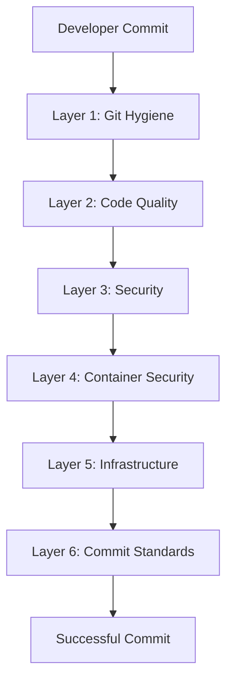

<div align="center">

# 🛡️ Pre-commit Tools Suite

*A robust, enterprise-grade pre-commit configuration enforcing code quality, security, and consistency standards.*

[](https://www.python.org/downloads/)
[](https://git-scm.com/)
[](https://www.docker.com/)
[](https://www.terraform.io/)
[](LICENSE)

[Quick Start](#quick-start) •
[Features](#core-features) •
[Architecture](#architecture) •
[CI/CD](#cicd-integration) •
[Troubleshooting](#troubleshooting)

---
</div>

## 📚 Table of Contents

- [Quick Start](#quick-start)
- [Core Features](#core-features)
- [Technical Requirements](#technical-requirements)
- [Architecture](#architecture)
  - [Validation Layers](#validation-layers)
- [Performance](#performance-optimization)
- [CI/CD Integration](#cicd-integration)
- [Troubleshooting](#troubleshooting)
- [Contributing](#contributing)

## Quick Start

```bash
pip install pre-commit>=3.5.0
pre-commit install && pre-commit install --hook-type commit-msg
```

## Core Features

<table>
<tr>
<td width="25%" align="center">
<h3>🔒 Security</h3>
<p>Zero-configuration scanning</p>
</td>
<td width="25%" align="center">
<h3>✨ Quality</h3>
<p>Automated formatting</p>
</td>
<td width="25%" align="center">
<h3>🏗️ IaC</h3>
<p>Infrastructure validation</p>
</td>
<td width="25%" align="center">
<h3>🐳 Docker</h3>
<p>Container best practices</p>
</td>
</tr>
</table>

## Technical Requirements

| Component | Version | Purpose |
|-----------|---------|----------|
| Python | 3.11+ | Runtime environment |
| Git | 2.28+ | Version control |
| Docker Engine | 20.10+ | Container validation |
| Terraform | 1.0+ | IaC validation |

## Architecture




### Validation Layers

<details>
<summary><b>Layer 1: Git Hygiene 📝</b></summary>

- Case-sensitive path conflicts
- Unresolved merge markers
- Invalid symlinks
- Large file restrictions (>500KB)
- Debug statement detection
- Syntax validation
- Line ending normalization
</details>

<details>
<summary><b>Layer 2: Code Quality ✨</b></summary>

#### Python Ecosystem
```yaml
- Black:
    scope: src/
    config: pyproject.toml
    exclude: tests/

- isort:
    profile: black
    sections: [FUTURE,STDLIB,THIRDPARTY,FIRSTPARTY,LOCALFOLDER]

- Ruff:
    fix: true
    scope: src/

- mypy:
    strict: true
    config: pyproject.toml
```
</details>

<details>
<summary><b>Layer 3: Security 🔒</b></summary>

#### Code Security
```yaml
- Bandit:
    config: pyproject.toml
    scope: "*.py"

- detect-secrets:
    baseline: .secrets.baseline
    exclude: [poetry.lock, tests/]

- Gitleaks:
    mode: protect
    exclude: [poetry.lock, tests/]
```
</details>

<details>
<summary><b>Layer 4: Container Security 🐳</b></summary>

```yaml
- hadolint:
    ignore: [DL3008, DL3013, DL3059]
    scope: [Dockerfile, dockerfiles/*]

- docker-compose-check:
    version: v3.0.1
    strict: true
```
</details>

<details>
<summary><b>Layer 5: Infrastructure 🏗️</b></summary>

```yaml
- yamllint:
    config: .yamllint.yaml
    strict: true

- terraform:
    - fmt
    - validate
    - tflint
    - checkov
```
</details>

## Performance Optimization

### ⚡ Fail-Fast Strategy
```yaml
fail_fast: true  # Terminate on first failure
default_stages: [commit, push]  # Dual-stage validation
```

## CI/CD Integration

<details>
<summary><b>GitHub Actions</b></summary>

```yaml
- uses: actions/checkout@v4
- uses: pre-commit/action@v3.0.0
```
</details>

<details>
<summary><b>GitLab CI</b></summary>

```yaml
pre-commit:
  image: python:3.11
  script:
    - pip install pre-commit
    - pre-commit run --all-files
```
</details>

## Troubleshooting

### 🔧 Common Commands

```bash
# Cache management
pre-commit clean
pre-commit gc

# Update hooks
pre-commit autoupdate

# Skip patterns
git commit -m "feat: critical hotfix" --no-verify
SKIP=black,isort git commit -m "feat: formatting exception"
```

## Contributing

We ❤️ contributions! Here's how you can help:

1. 🔍 Fork the repository
2. 🛠️ Create a feature branch
3. ✨ Run `pre-commit run --all-files`
4. 🎯 Submit a pull request

---

<div align="center">

📝 Licensed under MIT • Maintained by the Platform Engineering team

</div>
