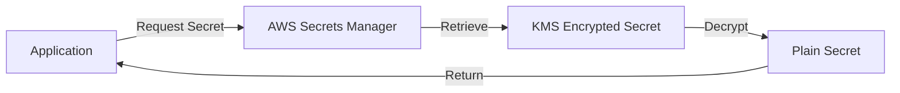
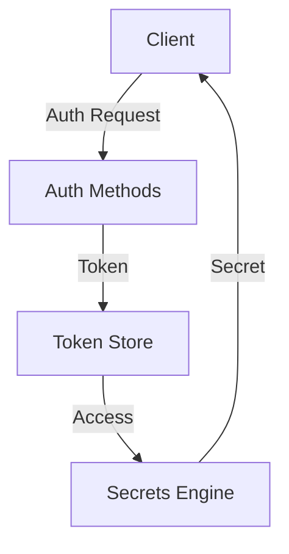
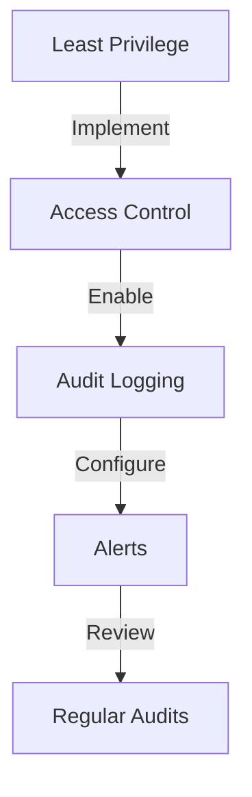

# 🔐 Secrets Management Tools Guide

*A comprehensive guide to securing, managing, and protecting sensitive information in modern software development.*

[Overview](#overview) •
[Tools](#tools-comparison) •
[Implementation](#implementation-guides) •
[Best Practices](#best-practices) •
[Contributing](#contributing)

---

## 📚 Table of Contents

- [Overview](#overview)
  - [Why Secrets Management?](#why-secrets-management)
  - [Key Considerations](#key-considerations)
- [Tools Comparison](#tools-comparison)
  - [Quick Reference](#quick-reference)
  - [Feature Matrix](#feature-matrix)
- [Detailed Solutions](#detailed-solutions)
  - [Cloud Native](#cloud-native-solutions)
  - [Open Source](#open-source-solutions)
  - [Enterprise](#enterprise-solutions)
  - [Security Scanners](#security-scanners)
- [Implementation Guides](#implementation-guides)
- [Best Practices](#best-practices)
- [Resources](#resources)

## Overview

### Why Secrets Management?

> *"Security is not a product, but a process."* - Bruce Schneier

In modern software development, proper secrets management is crucial for:

- 🛡️ **Security**: Protecting sensitive data from unauthorized access
- 🔄 **Automation**: Enabling secure CI/CD pipelines
- 📝 **Compliance**: Meeting regulatory requirements
- 🚀 **Scalability**: Supporting growing infrastructure needs

### Key Considerations

<table>
<tr>
<td width="33%" align="center">
<h3>🔒 Security</h3>

Encryption, access control, and audit logging

</td>
<td width="33%" align="center">
<h3>⚡ Performance</h3>

Low latency and high availability

</td>
<td width="33%" align="center">
<h3>🤝 Integration</h3>

Platform compatibility and API support

</td>
</tr>
</table>

## Tools Comparison

### Quick Reference

Choose your tool based on your primary needs:

| If You Need | Consider Using | Why? |
|-------------|----------------|-------|
| Cloud Native Solution | AWS Secrets Manager Azure Key Vault Google Secret Manager | Native integration Managed service Built-in compliance |
| Open Source Control | HashiCorp Vault Mozilla SOPS | Full control Flexibility Community support |
| Kubernetes Integration | Sealed Secrets External Secrets | Native K8s support GitOps friendly |
| Git-based Solution | git-crypt BlackBox | Simple setup Git workflow integration |

### Feature Matrix

| Tool | Type | 🔐 Encryption | 🔄 Rotation | 📊 Monitoring | 🤖 Automation | 💰 Cost |
|------|------|:------------:|:-----------:|:-------------:|:-------------:|:-------:|
| **Cloud Provider Solutions** ||||||
| AWS Secrets Manager | Managed | ✅ | ✅ | ✅ | ✅ | Pay-per-use |
| Azure Key Vault | Managed | ✅ | ✅ | ✅ | ✅ | Pay-per-use |
| Google Secret Manager | Managed | ✅ | ✅ | ✅ | ✅ | Pay-per-use |
| **Open Source Solutions** ||||||
| HashiCorp Vault | Self-hosted | ✅ | ✅ | ✅ | ✅ | Free* |
| Mozilla SOPS | CLI | ✅ | ❌ | ❌ | ✅ | Free |
| git-crypt | CLI | ✅ | ❌ | ❌ | ✅ | Free |
| **Security Scanners** ||||||
| GitLeaks | CLI | N/A | N/A | ✅ | ✅ | Free |
| ggshield | CLI/SaaS | N/A | N/A | ✅ | ✅ | Freemium |
| TruffleHog | CLI | N/A | N/A | ✅ | ✅ | Free |

## Detailed Solutions

### Cloud Native Solutions

<b>🚀 AWS Secrets Manager</b>

- **Key Features**
  - Automatic rotation
  - Fine-grained IAM
  - KMS integration
  - Multi-Region support

- **Best For**
  - AWS workloads
  - Regulated industries
  - Microservices

<b>🚀 Azure Key Vault</b>

- **Strengths**
  - HSM support
  - Certificate management
  - RBAC integration
  - Managed identities

- **Use Cases**
  - Azure workloads
  - PKI management
  - Key rotation

### Open Source Solutions

<b>🌟 HashiCorp Vault</b>

#### Architecture

- **Key Features**
  - Dynamic secrets
  - Multiple auth methods
  - Plugin system
  - High availability

- **Best For**
  - Enterprise deployments
  - Multi-cloud environments
  - Dynamic secrets

## Implementation Guides

### Getting Started Checklist

1. **Assessment Phase**
   - [ ] Identify sensitive data
   - [ ] Map access patterns
   - [ ] Document compliance requirements
   - [ ] Define rotation policies

2. **Tool Selection**
   - [ ] Compare feature requirements
   - [ ] Evaluate integration needs
   - [ ] Consider scaling requirements
   - [ ] Calculate costs

3. **Implementation**
   - [ ] Deploy solution
   - [ ] Configure access control
   - [ ] Set up monitoring
   - [ ] Document procedures

## Best Practices

### 🛡️ Security

### 🔄 Operations

1. **Rotation**
   - Automate rotation where possible
   - Use short-lived credentials
   - Monitor rotation status

2. **Monitoring**
   - Enable detailed audit logs
   - Set up alerts
   - Regular compliance checks

## Resources

| Resource Type | Links |
|--------------|-------|
| 📚 Documentation | [AWS](https://aws.amazon.com/secrets-manager/) • [Azure](https://azure.microsoft.com/services/key-vault/) • [GCP](https://cloud.google.com/secret-manager) |
| 💻 GitHub Repos | [Vault](https://github.com/hashicorp/vault) • [SOPS](https://github.com/mozilla/sops) • [git-crypt](https://github.com/AGWA/git-crypt) |
| 📖 Tutorials | [Getting Started](docs/getting-started.md) • [Best Practices](docs/best-practices.md) • [Security Guide](docs/security.md) |

## Contributing

We ❤️ contributions! Here's how you can help:

1. 🔍 Open an issue for discussion
2. 🛠️ Fork and create a PR
3. 📚 Improve documentation
4. 🎯 Add examples

See our [Contributing Guide](CONTRIBUTING.md) for details.

---

📝 Licensed under MIT • Created with ❤️ by the Community

